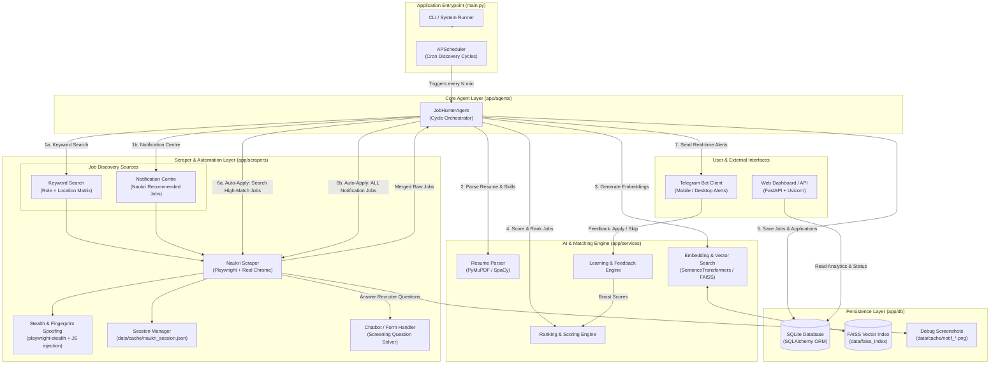

# AI Job Hunter Agent (Naukribot)

Production-grade autonomous job discovery, matching, auto-application, and tracking system for Naukri.com.

---

## 🏗️ System Architecture



---

## 🔄 Detailed System Workflow

```mermaid
flowchart TD
    subgraph P1["Phase 1: System Bootstrap & Setup"]
        A1["1. Launch Application (main.py)"] --> A2["2. Initialize SQLite Database Tables"]
        A2 --> A3["3. Parse Resume Text & Extract Skills (PyMuPDF / SpaCy)"]
        A3 --> A4["4. Load FAISS Vector Model & Encode Candidate Profile"]
        A4 --> A5["5. Start APScheduler, Telegram Bot & FastAPI Server"]
    end

    subgraph P2["Phase 2: Job Discovery (Dual-Source)"]
        A5 --> B1["6. Trigger Discovery Cycle (APScheduler / Manual)"]
        B1 --> B2["7. Launch Chrome Browser via Playwright"]
        B2 --> B3["8. Inject Anti-Bot Stealth Scripts & Spoof Fingerprints"]
        B3 --> B4["9. Load Cached Session Cookies (data/cache/naukri_session.json)"]

        B4 --> B5A["10a. Keyword Search\nRole × Location Matrix"]
        B4 --> B5B["10b. Notification Centre\nClick Bell → Scroll Panel → Extract Job URLs"]

        B5A --> B6["11. Extract Raw Job Cards & Build RawJob Objects"]
        B5B --> B6B["11b. Visit Each Notification Job URL\nExtract Full Job Detail (title, skills, exp, desc)"]
        B6B -->|source='naukri_notification'| MERGE
        B6 -->|source='naukri'| MERGE["12. Merge All Raw Jobs"]
    end

    subgraph P3["Phase 3: Filtering & Database Persistence"]
        MERGE --> C1["13. Deduplicate by External Job ID"]
        C1 --> C2["14. Apply Experience Filter\n(Search: skip exp ≥ 2 yrs)\n(Notification: no exp gate — Naukri already matched)"]
        C2 --> C3["15. Save Valid New Jobs to SQLite Database\nTagged by source field"]
    end

    subgraph P4["Phase 4: AI Matching & Ranking Engine"]
        C3 --> D1["16. Generate FAISS Vector Embedding for Job Text"]
        D1 --> D2["17. Cosine Similarity — Job vs. Resume Embedding"]
        D2 --> D3["18. Calculate Skill Fit, Location Match & Experience Score"]
        D3 --> D4["19. Apply Historical Feedback Boost (Learning Engine)"]
        D4 --> D5["20. Compute Final Match Score (0–100%) & Save to DB"]
    end

    subgraph P5["Phase 5: Auto-Apply (Dual Strategy)"]
        D5 --> E1A["21a. Search Jobs:\nFilter exp ≤ 1 yr AND score ≥ threshold OR skill match ≥ 50%\nApply to top 5 per cycle"]
        D5 --> E1B["21b. Notification Jobs:\nApply to ALL — no score/experience gate"]
        E1A --> E2["22. Navigate to Job Apply Page via Playwright"]
        E1B --> E2
        E2 --> E3["23. Locate & Verify Direct Apply Button\n(15 layered fallback selectors)"]
        E3 --> E4["24. Click Apply & Solve Screening Form\n(ChatbotHandler — auto-answers recruiter questions)"]
        E4 --> E5["25. Update Application Status in SQLite DB\n(notes: 'Auto-applied' or 'Notification recommendation')"]
        E5 --> E6["26. Dispatch Telegram Alert\n(✅ Search apply  |  🔔 Notification apply)"]
    end

    subgraph P6["Phase 6: Learning & Maintenance"]
        E6 --> F1["27. Update Skill Gap Table (skills required but not in profile)"]
        F1 --> F2["28. Persist FAISS Index to Disk"]
        F2 --> F3["29. Telegram Feedback → Learning Engine\n(apply / skip signals re-weight future scores)"]
    end
```



---

## 🔔 Notification Centre Job Discovery

The bot taps into Naukri's personalised **Notification Centre** in addition to the standard keyword search. This captures jobs that Naukri's own AI recommends for your profile but may not appear in public search results.

**How it works:**

1. After login, navigates to the Naukri homepage
2. Clicks the **notification bell icon** (15 layered CSS fallback selectors)
3. Scrolls the notification panel to load all lazy-rendered cards
4. Extracts every job URL linked from notification cards (recommended, job-alert, and "new jobs matching" cards)
5. Falls back to `https://www.naukri.com/notifications` if the panel is not detected
6. Visits each job URL individually and extracts a full `RawJob` (title, company, location, skills, description, experience, etc.)
7. Tags all notification jobs with `source = "naukri_notification"` in the database

**Apply behaviour for notification jobs:**
- **No experience gate** — Naukri already matched these to your profile, so the bot applies regardless of the listed experience range
- **No per-cycle cap** — applies to every notification job found (vs. top 5 cap for search-sourced jobs)
- Debug screenshots saved to `data/cache/notif_homepage.png`, `notif_panel_open.png`, `notif_panel_scrolled.png`, `notif_links_found.png` for diagnosing selector failures

---

## 🕵️ Scraping, Stealth & Session Security

- **Playwright + Real Chrome:** Uses Playwright to launch a real Google Chrome channel (`channel="chrome"`) instead of standard headless Chromium.
- **`playwright-stealth` & Custom JS Injection:** Overrides `navigator.webdriver` to `undefined`, masks `window.chrome`, spoofs OS platform (`Win32`), `languages`, and `plugins`.
- **Session Cache:** Caches authenticated login cookies in `data/cache/naukri_session.json`. Re-uses session across runs to prevent frequent logins.
- **Automated Screening Handler (`ChatbotHandler`):** Intercepts and auto-answers recruiter questionnaire popups during application submission based on candidate profile skills.
- **Debug Screenshots:** Every major automation step (login, notification panel, apply flow) saves screenshots to `data/cache/` for diagnosing failures without re-running.

---

## 🔍 Job Discovery Sources

| Source | Method | Experience Gate | Apply Cap |
|---|---|---|---|
| **Keyword Search** | Role × Location matrix via Naukri search URL | Skip jobs with `exp_min ≥ 2 yrs` | Top 5 per cycle |
| **Notification Centre** | Bell icon → panel → job URL extraction | **None** (Naukri pre-matched) | **All found** |

---

## 🛠️ Stack & Dependencies

| Layer | Technology |
|---|---|
| **Web Automation** | Playwright, `playwright-stealth`, Real Chrome |
| **Embeddings & AI** | `sentence-transformers/all-MiniLM-L6-v2`, FAISS |
| **Resume Parsing** | PyMuPDF, spaCy |
| **API & Server** | FastAPI, Uvicorn |
| **Database** | SQLite, SQLAlchemy ORM |
| **Scheduler** | APScheduler |
| **Alerts & Bot** | `python-telegram-bot` |
| **Containerization** | Docker, Docker Compose |

---

## 🚀 Quick Start

1. **Configure Environment:**
   ```bash
   cp config.example.yaml config/config.yaml
   # Fill in naukri.email, naukri.password, telegram.bot_token, telegram.chat_id
   ```
2. **Run Locally:**
   ```bash
   python main.py
   ```
3. **Run a single cycle (for testing):**
   ```bash
   python main.py --once
   ```
4. **Bootstrap profile only (no scraping):**
   ```bash
   python main.py --bootstrap-only
   ```
5. **Run via Docker:**
   ```bash
   docker compose up --build
   ```

---

## 📁 Project Structure

```
Naukribot/
├── main.py                        # Application entry point (CLI + async runner)
├── config.example.yaml            # Configuration template
├── app/
│   ├── agents/
│   │   └── job_hunter_agent.py    # Main cycle orchestrator
│   ├── scrapers/
│   │   └── naukri_scraper.py      # Playwright automation:
│   │                              #   login, keyword search,
│   │                              #   notification centre, auto-apply,
│   │                              #   chatbot handler integration
│   ├── services/
│   │   ├── chatbot_handler.py     # Screening question auto-answerer
│   │   ├── embedding_engine.py    # SentenceTransformers + FAISS
│   │   ├── ranking_engine.py      # Multi-factor job scoring
│   │   ├── learning_engine.py     # Feedback-based score boosting
│   │   ├── profile_engine.py      # Resume parse + profile build
│   │   └── telegram_service.py   # Bot alerts & commands
│   ├── api/
│   │   └── main.py               # FastAPI web dashboard
│   ├── core/
│   │   ├── config.py             # Pydantic settings loader
│   │   ├── logging.py            # Loguru logger setup
│   │   ├── scheduler.py          # APScheduler wrapper
│   │   └── network.py            # Network health checks
│   └── db/
│       ├── models.py             # SQLAlchemy ORM models
│       └── session.py            # DB session context manager
├── data/
│   ├── resume.pdf                # Your resume (PDF)
│   ├── cache/                    # Session cookies + debug screenshots
│   ├── faiss_index/              # Persisted FAISS vector index
│   └── job_hunter.db             # SQLite database
└── docs/                         # Additional documentation
```

---

## 📊 Dashboard & Commands

- **Web Dashboard:** `http://localhost:8000`

### Telegram Commands
| Command | Description |
|---|---|
| `/jobs` | Latest matched jobs |
| `/topjobs` | Top 20 ranked jobs |
| `/newjobs` | Jobs scraped in last 1 hour |
| `/stats` | Application statistics & metrics |
| `/companies` | Top hiring companies list |
| `/skillgaps` | Identified skill gap analytics |
