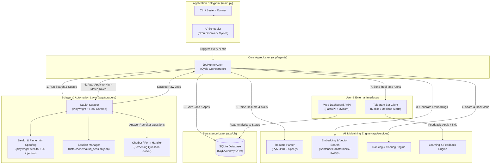

# Naukribot — System Architecture & Workflow Documentation

This document provides complete technical specifications, architecture diagrams, and phase-by-phase workflow flowcharts for **Naukribot** (AI Job Hunter Agent).

---

## 🏛️ 1. High-Level System Architecture

The system follows an event-driven, agentic orchestrator architecture. The central `JobHunterAgent` coordinates scraping, parsing, vector embedding, job scoring, auto-application, and real-time alerting.

---

## 🔲 2. System Workflow Flowchart (Step-by-Step)

The diagram below maps every step executed by Naukribot from startup to automated job application:

```mermaid
flowchart TD
    subgraph P1["Phase 1: System Bootstrap & Setup"]
        A1["1. Launch Application (main.py)"] --> A2["2. Initialize SQLite Database Tables"]
        A2 --> A3["3. Parse Resume Text & Extract Skills (PyMuPDF / SpaCy)"]
        A3 --> A4["4. Load FAISS Vector Model & Encode Candidate Profile"]
        A4 --> A5["5. Start APScheduler, Telegram Bot & FastAPI Server"]
    end

    subgraph P2["Phase 2: Scraping & Job Discovery"]
        A5 --> B1["6. Trigger Discovery Cycle (APScheduler / Manual)"]
        B1 --> B2["7. Launch Chrome Browser via Playwright"]
        B2 --> B3["8. Inject Anti-Bot Stealth Scripts & Spoof Fingerprints"]
        B3 --> B4["9. Load Cached Session Cookies (data/cache/naukri_session.json)"]
        B4 --> B5["10. Execute Search Query Matrix (Role + Location)"]
        B5 --> B6["11. Extract Raw Job Cards & Job Metadata"]
    end

    subgraph P3["Phase 3: Filtering & Database Persistence"]
        B6 --> C1["12. Check External Job ID against Database (Deduplication)"]
        C1 --> C2["13. Apply Hard Experience & Location Filters"]
        C2 --> C3["14. Save Valid New Jobs to SQLite Database"]
    end

    subgraph P4["Phase 4: AI Matching & Ranking Engine"]
        C3 --> D1["15. Generate FAISS Vector Embedding for Scraped Job Text"]
        D1 --> D2["16. Compute Cosine Similarity between Job & Resume Embeddings"]
        D2 --> D3["17. Calculate Skill Fit, Experience Match & Freshness Scores"]
        D3 --> D4["18. Apply Historical User Feedback Boost (Learning Engine)"]
        D4 --> D5["19. Compute Final Match Score (0 - 100%) & Save to DB"]
    end

    subgraph P5["Phase 5: Auto-Apply & Notifications"]
        D5 --> E1["20. Filter Roles Meeting Match Threshold (Score ≥ Threshold)"]
        E1 --> E2["21. Navigate to Job Apply Page via Playwright Scraper"]
        E2 --> E3["22. Verify Direct 1-Click Apply Button"]
        E3 --> E4["23. Click Apply & Solve Screening Form (ChatbotHandler)"]
        E4 --> E5["24. Update Application Status to 'Applied' in SQLite DB"]
        E5 --> E6["25. Dispatch Instant Telegram Alert & Refresh Web Dashboard"]
    end
```

---

## 📘 3. Phase Specifications

### Phase 1: System Bootstrap & Setup
* **`init_db()`**: Bootstraps SQLite tables (`jobs`, `job_applications`, `candidate_profiles`, `user_skills`) using SQLAlchemy ORM.
* **Resume Extraction:** `ResumeParser` extracts text from `.pdf`/`.docx` files using PyMuPDF and SpaCy NER models.
* **Vector Model Initialization:** `EmbeddingEngine` pre-loads `sentence-transformers/all-MiniLM-L6-v2` into FAISS vector memory.

### Phase 2: Scraping & Job Discovery
* **Real Browser Control:** Playwright launches Google Chrome (`channel="chrome"`).
* **Stealth Evasion:** Overrides `navigator.webdriver`, hides `window.chrome`, spoofs `Win32` platform, and mocks permissions APIs.
* **Cookie Caching:** Restores cached session cookies from `data/cache/naukri_session.json` to prevent re-logins.
* **Matrix Querying:** Iterates over combinations of target roles, skills, and locations.

### Phase 3: Filtering & Database Persistence
* **Deduplication:** Filters out jobs that already exist in SQLite based on `external_id`.
* **Criteria Enforcement:** Skips jobs requiring experience outside configured bounds (`experience_min`, `experience_max`).
* **Session Safety:** Uses plain `JobData` dataclasses to pass data safely across async threads without `DetachedInstanceError`.

### Phase 4: AI Matching & Ranking Engine
* **Semantic Match (40%):** Calculates cosine similarity between vector embeddings of job descriptions and candidate resume text via FAISS.
* **Skill Fit Match (20%):** Matches job required skills against candidate skill taxonomy.
* **Location & Experience Match (30%):** Compares preferred cities and years of experience.
* **Freshness & Feedback Boost (10%):** Adds score bonuses for jobs posted in the last 24h and applies preference boosts learned by `LearningEngine`.

### Phase 5: Auto-Apply & Notifications
* **Direct Apply Check:** Filters jobs for 1-Click direct apply buttons.
* **Questionnaire Solver:** `ChatbotHandler` automatically responds to modal forms and recruiter screening prompts using candidate profile data.
* **Instant Alerts:** Sends interactive Telegram messages detailing match scores, missing skills, and application status.

---

## 🕵️ 4. Uncovering Hidden Jobs on Naukri

Naukri search caps results at Page 50 (1,000 listings). Naukribot bypasses this using four specific strategies:

1. **Exhaustive Query Slicing (`freshness=1`):** Appends `freshness=1` parameter to search URLs to capture newly posted jobs within the last 24 hours before they get buried past page 50.
2. **Boolean Query Parameter (`qp`):** Uses explicit string parameters like `qp="Machine Learning" AND ("Python" OR "PyTorch")` for strict indexing.
3. **Recommended Engine Feed (`/mnjuser/recommendedjobs`):** Scrapes authenticated candidate recommendation feeds which surface unlisted roles tailored to candidate profile tags.
4. **Daily Profile Activity Touch:** Re-uploading resume daily bumps `lastUpdatedTimestamp`, keeping candidate profiles visible in recruiter outbound searches.

---

## 📂 Related Files

* **Main Orchestrator:** [`app/agents/job_hunter_agent.py`](file:///c:/Users/prane/Downloads/Naukribot/app/agents/job_hunter_agent.py)
* **Playwright Scraper:** [`app/scrapers/naukri_scraper.py`](file:///c:/Users/prane/Downloads/Naukribot/app/scrapers/naukri_scraper.py)
* **Ranking Engine:** [`app/services/ranking_engine.py`](file:///c:/Users/prane/Downloads/Naukribot/app/services/ranking_engine.py)
* **Telegram Service:** [`app/services/telegram_service.py`](file:///c:/Users/prane/Downloads/Naukribot/app/services/telegram_service.py)
